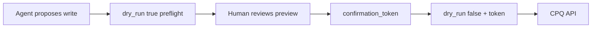

# Features and security

Product overview for the Oracle CPQ MCP server (**package 0.2.0**) and related local tooling. For per-tool tables see [`TOOL_CATALOG.md`](TOOL_CATALOG.md). Changelog: [`RELEASE_NOTES.md`](RELEASE_NOTES.md). Setup: [`QUICKSTART.md`](QUICKSTART.md).

---

## Detailed features

### MCP tool catalog (100 tools)

| Domain | What it covers |
|--------|----------------|
| **Users** | List/get/export users, user groups, patch update (write) |
| **Groups** | List/get groups, group members, create group (write) |
| **Data tables** | List/get/rows, deploy, create, export |
| **BML** | Full code export, scripts search, common functions, library folders, dependent attributes, library export |
| **Commerce** | Process/line attributes and actions; transactions; commerce UI settings; saved searches |
| **Metrics** | Site metrics list with optional time filters and METRICS_* descriptions |
| **Collab** | Collaborative quote operation queue get/clear |
| **Admin** | Site certificates list/get; SSO configuration (PEM redacted) |
| **Performance** | Performance log list/get/export |
| **Parts** | Parts search and get |
| **Tasks** | Get task status; download task file (async export follow-up) |
| **Configuration** | productFamilies / layoutcache composites |
| **Meta** | `discover_tools`, saved refined-prompt tools, local `data/` sync and policy |

Regenerate the formal catalog after tool changes:

```bash
python scripts/generate_tool_catalog.py
```

### Diagnostics

- **DEBUG_MODE** (profile default true; host `CPQ_DEBUG_MODE` / `CPQ_DEBUG_LOG_DIR`) — redacted CPQ request traces in `logs/{profile}-{environment}.log`. See [FAQ](FAQ.md#where-are-debug_mode-api-logs).

### Output and agent UX

- **Structured envelopes** — reads/writes return `{status, tool, data}` (or attachment + envelope for Excel/zip).
- **Structured errors** — `{status: error, code, message, hint, details}`; credentials stripped.
- **Pagination hints** — `hasMore` / `nextOffset` / suggested next call on list tools.
- **Progress** — long fetches (exports, BML) report progress where supported.

### Refined prompts (token-efficient reuse)

- After CPQ-related work (live MCP and/or local cache), agents append **`### Refined prompt (Better token usage)`** with title, tags, **output format**, **cached data**, prose with `{{placeholders}}`, Variables, and Tools.
- Profile flags: `REFINED_PROMPT` (default true), `AUTO_SAVE_REFINED_PROMPT` (default false).
- Library: `.config/saved_prompts.json` (gitignored). Tools: `offer_save_refined_prompt`, `save_refined_prompt`, `list_saved_prompts`, `search_saved_prompts`, `get_saved_prompt`, `record_prompt_use`, `set_saved_prompt_enabled`, `start_prompt_picker`, `set_auto_save_refined_prompt`.
- Cursor: **`/OracleCPQ_SavedPrompts`** or “use a saved prompt”.

### Local `data/` snapshots

- Path: `data/{profile}/{env}/…` (gitignored).
- Sync tools: `sync_users_local`, `sync_groups_local`, `sync_bml_local`, `sync_commerce_metadata_local`, `sync_datatable(s)_local`.
- UX: `list_local_data`, `get_local_data_status`, `offer_use_local_data`, `load_local_data`, `set_local_data_policy`.
- Policy: `LOCAL_DATA_POLICY=ask|prefer|never` (default `ask`). Auto-persist also from `export_users_excel` / `get_all_bml_code`.
- **BML zip (`get_all_bml_code` delivery=zip):** saves the archive under `data/.../bml/` **and** extracts the full site tree to `data/.../bml/site/` (zip-slip safe).

### Post-response Excel / Word export

- After tabular chat answers, agents can offer an export (default) via `offer_export_response`.
- Policy: `POST_RESPONSE_EXPORT=ask|never|always_excel` (default `ask`). Writable via `set_post_response_export` or offer choices `always_excel` / `never`.
- `export_response_excel` — multi-sheet `.xlsx` under `data/{profile}/{env}/exports/` + MCP File attachment.
- `export_response_word` — `.docx` under the same folder + local `file://` URI (optional dep: `python-docx`, install with `pip install python-docx` or `pip install -e ".[docs]"`).
- Agent must pass structured `sheets: [{name, columns?, rows}]` — markdown scraping is not supported.

### Prompt Studio (local UI)

Lightweight FastAPI + static UI to browse/fill saved prompts. Does **not** call Oracle CPQ. See [Prompt Studio](#prompt-studio-enable-and-run) below and [`apps/prompt_studio/README.md`](../apps/prompt_studio/README.md).

### Profiles and environments

- Per-customer `.config/<profile>.env` (gitignored); template `.config/.env.example`.
- Environments: `dev` / `test` / `prod` credential sets; `DEFAULT_ENVIRONMENT`.
- Host-only: `CPQ_CUSTOMER_PROFILE`, `CPQ_CONFIG_DIR`, `CPQ_CONFIRMATION_SECRET`, `CPQ_ALLOW_PROD`, schema integrity flags.
- **`DEBUG_MODE`** (default true) — appends timestamped, redacted CPQ request traces (curl + parameters) to `logs/{profile}-{environment}.log`. Override with `CPQ_DEBUG_MODE` / `CPQ_DEBUG_LOG_DIR`. Independent of `CPQ_VERBOSE` (stderr).
- **Knowledge base** — shared [`knowledge/CPQBaseKnowledge.md`](../knowledge/CPQBaseKnowledge.md) is always injected into MCP server instructions; optional `CUSTOMER_KNOWLEDGE_FILE` (e.g. `focalpoint.md`) loads [`knowledge/{file}`](../knowledge/). Reload MCP after edits.
- **Property aliases** — pair `COMMERCE_PROCESS_VAR_NAME` with `COMMERCE_PROCESS_ALIAS` (and `_1` / `_2` …), and `CUSTOM_DATA_TABLE_NAME` with `CUSTOM_DATA_TABLE_ALIAS`. Phrases like “base commerce process” resolve to the mapped var name in agent instructions. Optional `COMMERCE_PROCESS_ENABLED[_N]` (default true) omits disabled slots from defaults/aliases while keeping rows in the env; reload MCP after changes.

### Live testing status (honest scope)

Offline unit/contract tests cover the catalog. Some **scope C** areas remain **untested live** (tasks, configuration productFamilies, newer datatable create/export, some BML extensions) — see the table in [`README.md`](../README.md).

---

## Security guardrails and human-in-the-loop

Authoritative security docs: [`SECURITY.md`](../SECURITY.md), [`THREAT_MODEL.md`](../THREAT_MODEL.md), [`SECURITY_TESTING.md`](../SECURITY_TESTING.md).

### Design principle

**Never rely on the LLM alone to enforce a rule that can be enforced in the MCP server.** User prompts, tool args, and CPQ payloads are untrusted.

### Server-side guardrails (always on)

| Control | Behavior |
|---------|----------|
| **READ_ONLY profile (default true)** | Blocks all create/update/deploy mutations |
| **Strict schemas** | Pydantic `extra=forbid`; blocked security args (`environment`, credentials, etc.) |
| **Risk classes** | READ_ONLY / PRIVILEGED / HIGH_RISK_WRITE / DESTRUCTIVE |
| **Deny-by-default authz** | Unknown tools denied; prod blocked unless `CPQ_ALLOW_PROD=1` |
| **Rate limits + session cap** | Per-tool window; `CPQ_MAX_TOOL_CALLS` |
| **Replay protection** | Duplicate write tokens rejected |
| **Output redaction** | Sensitive fields stripped from tool responses |
| **Schema integrity** | Startup manifest hash (`CPQ_SCHEMA_INTEGRITY`) |
| **Audit** | Structured events without secrets |
| **CPQClient only** | All CPQ HTTP goes through one client (sanitized errors) |

### Human-in-the-loop (writes)

Mutating tools (`update_user`, `create_group`, `deploy_datatables`, `create_datatable`, …) follow:



1. **Default `dry_run=true`** — preflight only; returns a preview and (when configured) an HMAC `confirmation_token`.
2. **Human approval** — user must explicitly approve before any apply.
3. **Apply** — `dry_run=false` **and** valid `confirmation_token` bound to tool + args hash + customer + env.
4. **Still blocked** if `READ_ONLY=true` on the profile.

Host must set `CPQ_CONFIRMATION_SECRET` when enabling writes (`READ_ONLY=false`). Never put CPQ passwords or the confirmation secret in MCP JSON or chat.

### Prompt Studio security (v1)

- Binds to **`127.0.0.1` only**; no auth.
- Reads prompt bodies from the saved library; studio state (favorites/suites/history) in `.config/prompt_studio.json` (gitignored).
- Does **not** call Oracle CPQ or replace MCP write guardrails.

---

## Prompt Studio: enable and run

### Enable (install deps)

Use the **project venv** (recommended):

```powershell
.\.venv\Scripts\python.exe -m pip install '.[prompt-studio]'
```

Optional extra in [`pyproject.toml`](../pyproject.toml): `fastapi`, `uvicorn`.

### Run

From the **repo root**:

```powershell
.\.venv\Scripts\python.exe -m apps.prompt_studio
```

Open [http://127.0.0.1:8765](http://127.0.0.1:8765).

### Use with MCP saved prompts

1. In Cursor/Antigravity, complete a CPQ task so a refined prompt is offered/saved (`offer_save_refined_prompt` / `save_refined_prompt` / `AUTO_SAVE_REFINED_PROMPT=true`).
2. In Prompt Studio click **Refresh** to reload `.config/saved_prompts.json`.
3. Browse **Cards** or **List**; filter by tags/favorites; **Run** fills `{{placeholders}}` and shows **expected response format** (Text / JSON / Excel).

### Env overrides

| Variable | Purpose |
|----------|---------|
| `CPQ_SAVED_PROMPTS_PATH` | Alternate `saved_prompts.json` |
| `CPQ_PROMPT_STUDIO_PATH` | Alternate `prompt_studio.json` sidecar |

---

## Related documents

| Doc | Role |
|-----|------|
| [`TOOL_CATALOG.md`](TOOL_CATALOG.md) | Formal per-tool Parameters / Filters tables |
| [`QUICKSTART.md`](QUICKSTART.md) | Install, MCP connect, sample prompts |
| [`STANDARDS.md`](STANDARDS.md) | Authoring checklist for new tools |
| [`RELEASE_NOTES.md`](RELEASE_NOTES.md) | Changelog |
| [`SECURITY.md`](../SECURITY.md) | Guardrail architecture |
