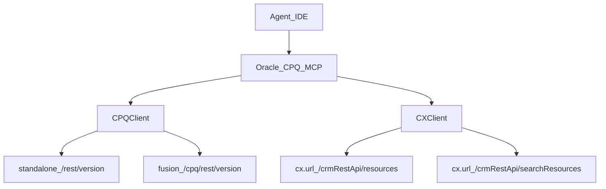
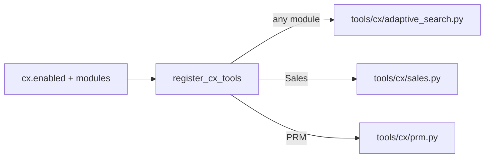
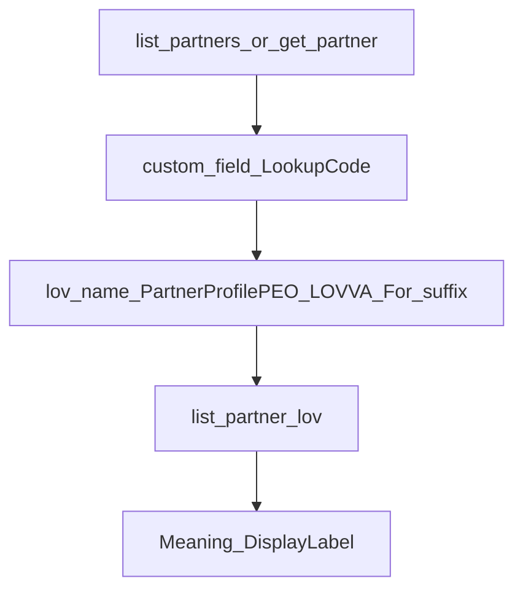
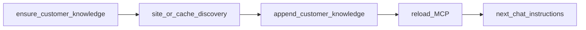
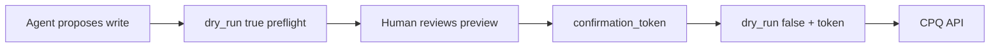

# Features and security

Product overview for the Oracle CPQ MCP server (**package 0.3.0**) and related local tooling. For per-tool tables see [`TOOL_CATALOG.md`](TOOL_CATALOG.md). Changelog: [`RELEASE_NOTES.md`](RELEASE_NOTES.md). Setup: [`SETUP.md`](SETUP.md) (quick) · [`QUICKSTART.md`](QUICKSTART.md) (full). Live honesty: [`LIVE_SMOKE_MATRIX.md`](LIVE_SMOKE_MATRIX.md).

---

## Detailed features

### MCP tool catalog (183 tools)

The **183** figure is the full `TOOL_CATALOG` (CPQ + meta + Sales + PRM). A live MCP process only **registers** CX tools for modules listed in `cx.modules` (reload after YAML changes). Cursor’s MCP panel may also list a host helper such as `mcp_auth` — that is not an Oracle catalog tool.


```mermaid
flowchart TB
  agent[Agent_IDE]
  mcp[Oracle_CPQ_MCP]
  cpqClient[CPQClient]
  cxClient[CXClient]
  agent --> mcp
  mcp --> cpqClient
  mcp --> cxClient
  cpqClient --> standalone["standalone_/rest/version"]
  cpqClient --> fusionCpq["fusion_/cpq/rest/version"]
  cxClient --> crmAdf["cx.url_/crmRestApi/resources"]
  cxClient --> crmAs["cx.url_/crmRestApi/searchResources"]
```

| Domain | What it covers |
|--------|----------------|
| **Users** | List/get/export users, user groups, patch update (write) |
| **Groups** | List/get groups, group members, create group (write) |
| **Data tables** | List/get/rows, deploy, create, export |
| **BML** | Full code export (sync + **async local job**), local text search, scripts search, common functions, library folders, dependent attributes, library export |
| **Commerce** | Process/line attributes and actions; transactions (read + create/save/submit/version/reconfigure/favorites/history; line add/update/delete/copy/interact/reconfigure); commerce UI settings; saved searches; **`list_commerce_processes_table`** |
| **Metrics** | Site metrics list with optional time filters and METRICS_* descriptions |
| **Collab** | Collaborative quote operation queue get/clear |
| **Admin** | Site certificates list/get; SSO configuration (PEM redacted); **`get_fusion_access_token`** (CPQ Bearer oauth_*) |
| **Sales (CX)** | Top-level lists via **Adaptive Search**; `get_*` and account/opportunity children via ADF. Plus Adaptive Search discovery/suggest tools (`list_adaptive_search_*`, `suggest_adaptive_search`). Requires `Sales` (lists/gets) or any CX module (discovery). |
| **PRM (CX)** | Top-level partner/deal/program/tier lists via Adaptive Search; `get_*`, geographies, partner-contact children, and **`list_partner_lov`** via ADF (`tools/cx/prm.py`; requires `PRM`). |
| **Performance** | Performance log list/get/export |
| **Parts** | Parts search and get |
| **Tasks** | Get task status; download task file (async export follow-up) |
| **Configuration** | productFamilies / layoutcache; **`list_product_hierarchy_table`** (family→line→model flat table) |
| **Meta** | `discover_tools`, `get_local_job`, saved refined-prompt tools, `ensure_prompt_studio`, customer knowledge, local `data/` sync and policy, post-response export |

Regenerate the formal catalog after tool changes:

```bash
python scripts/generate_tool_catalog.py
```

Each tool table in [`TOOL_CATALOG.md`](TOOL_CATALOG.md) lists **CPQ REST URL** and **Fusion REST URL**. For CPQ tools those columns are `/rest/{version}…` vs `/cpq/rest/{version}…` (`CPQClient` from nested `cpq.hosted` / `cpq.auth`). For Sales/PRM tools the Fusion column is the **CRM** path on `cx.url` — either Adaptive Search (`/crmRestApi/searchResources/11.13.18.05/…`) for top-level `list_*`, or ADF (`/crmRestApi/resources/11.13.18.05/…`) for `get_*` / children / LOVs. The CPQ column is marked not-CPQ.

**CPQ collection filters:** Paginated CPQ `list_*` tools share MongoDB-style **`q_expr`**, **`orderby`**, **`fields`**, **`finder`**, **`total_results`**, and **`only_data`** (see Oracle CPQ REST Query/Sort/Paginate docs). Applicable **`get_*`** tools accept **`expand`** / **`exclude_field_types`**. This is separate from Fusion CX Adaptive Search JSON `q`. Refined-prompt YES-gate uses **Search / CPQ collections** vs **Search / Adaptive Search**; saved prompts stamp tags `cpq` / `cx` plus CX module.

### Fusion CX (Sales and PRM)

Enable a nested `environments.<env>.cx` block (`enabled: true`, `url`, `auth`, required `modules`). `register_cx_tools` always registers **Adaptive Search discovery/suggest** when any module is enabled, then loads Sales/PRM product handlers. `discover_tools(cx_module="sales"|"prm")` filters the catalog. Service / Field Service / Subscription / Incentive Compensation remain **allowlist names only** (no handlers yet).


```mermaid
flowchart LR
  yaml["cx.enabled + modules"]
  reg[register_cx_tools]
  asTools[tools/cx/adaptive_search.py]
  sales[tools/cx/sales.py]
  prm[tools/cx/prm.py]
  yaml --> reg
  reg -->|"any module"| asTools
  reg -->|"Sales"| sales
  reg -->|"PRM"| prm
```

**Adaptive Search vs ADF**

| Surface | Path | Tools |
|---------|------|--------|
| Top-level lists | POST `searchResources/…/custom-actions/queries` (`Preference: transient`) | `list_accounts`, `list_contacts`, `list_leads`, `list_opportunities`, `list_products`, `list_territories`, `list_partners`, `list_partner_contacts`, `list_deals`, `list_partner_programs`, `list_partner_tiers` |
| Discovery / suggest | GET `metaModels` / `entities` / `fields` / `searchOperators`; POST queries (`Preference: recommend`) | `list_adaptive_search_*`, `suggest_adaptive_search` |
| Items + children + LOV | GET `resources/…` | all `get_*`, `list_account_*`, `list_opportunity_*`, `list_partner_geographies`, `list_partner_contact_*`, `list_partner_lov` |

Top-level list filters use Adaptive Search JSON `q` / `keywords` (not ADF SCIM). Entity names live in `CX_AS_ENTITY_BY_TOOL`. **Do not** use Adaptive Search for CPQ — CPQ `searchResources` is commerce saved searches only.

Partner status codes (example `PartnerProfilePEO_gnx_sls_Status_c`) are LookupCode values. Resolve them with **`list_partner_lov`** — do not guess Meaning from the code string.


```mermaid
flowchart TD
  listP[list_partners_or_get_partner]
  field["custom_field_LookupCode"]
  lovName["lov_name_PartnerProfilePEO_LOVVA_For_suffix"]
  lov[list_partner_lov]
  meaning[Meaning_DisplayLabel]
  listP --> field --> lovName --> lov --> meaning
```

Convention: field `PartnerProfilePEO_<suffix>` → `lov_name=PartnerProfilePEO_LOVVA_For_<suffix>`. If unknown, `get_partner(only_data=false)` and follow `rel=lov` links. Optional `lookup_code` filters `q=LookupCode="…"`. Partners are keyed by **CompanyNumber** (not display name).

### Profile modes (`cpq.hosted` + `cpq.auth`)

| Nested CPQ | Auth | REST prefix | Profile sample |
|------------|------|-------------|----------------|
| `hosted: standalone` (default) + `auth: basic` | Basic Auth | `/rest/{rest_api_version}` | [`.config/example.yaml`](../.config/example.yaml) |
| `hosted: fusion` + `auth: bearer` | OAuth client_credentials → Bearer | `/cpq/rest/{rest_api_version}` | [`.config/example_fusion.yaml`](../.config/example_fusion.yaml) |

- Same MCP tools and `api_path` values — prefix from `hosted`, header from `auth`.
- Bearer requires per-product `oauth_*`; Basic requires `credentials`.
- Agents never edit oauth secrets (same rule as passwords). Optional explicit token: `get_fusion_access_token` (CPQ `auth: bearer`).

### Diagnostics

- **DEBUG_MODE** (profile default true; host `CPQ_DEBUG_MODE` / `CPQ_DEBUG_LOG_DIR`) — redacted CPQ request traces in `logs/{profile}-{environment}.log`. See [FAQ](FAQ.md#where-are-debug_mode-api-logs).

### Output and agent UX

- **Structured envelopes** — reads/writes return `{status, tool, data}` (or attachment + envelope for Excel/zip); stamped with **`profile`** + **`environment`**.
- **Structured errors** — `{status: error, code, message, hint, details}`; credentials stripped.
- **Pagination hints** — `hasMore` / `nextOffset` / suggested next call on list tools.
- **Async BML** — `start_bml_site_export` → `get_local_job`; local grep via `search_local_bml`.
- **MCP resources** — `cpq://local`, `cpq://local/bml/{path}` for cache grounding without huge tool payloads.
- **HTTP timeout** — profile `HTTP_TIMEOUT` / host `CPQ_HTTP_TIMEOUT` (default 60s, range 5–3600).
- **Dual env** — example dual MCP configs under `.cursor/` and `.agents/`; cite profile/env when comparing.
- **Capability / smoke honesty** — server instructions include a capability card; live status in [`LIVE_SMOKE_MATRIX.md`](LIVE_SMOKE_MATRIX.md).
- **Elicitation** — prefer host MCP elicitation for offer_* tools when available; chat `needs_user_input` fallback otherwise.
- **Progress** — long fetches (exports, BML) report progress where supported.

### Refined prompts (token-efficient reuse)

- After CPQ-related work (live MCP and/or local cache), agents append **`### Refined prompt (Better token usage)`** with title, tags, **output format**, **cached data**, prose with `{{placeholders}}`, optional **Search / Adaptive Search** (list filters actually used), Variables, and Tools.
- Profile flags: `REFINED_PROMPT` (default true), `AUTO_SAVE_REFINED_PROMPT` (**example** profile default true; each customer YAML may set false), `include_refined_prompt_in_documents` (default true — Word/Excel start with filled search params, no Variables).
- Library: `.prompts/saved_prompts.json` (gitignored). Tools: `offer_save_refined_prompt`, `save_refined_prompt`, `list_saved_prompts`, `search_saved_prompts`, `get_saved_prompt`, `record_prompt_use` (optional `duration_ms` + `source=cache|api|mixed`), `set_saved_prompt_enabled`, `start_prompt_picker`, `set_auto_save_refined_prompt`.
- Cursor: **`/OracleCPQ_SavedPrompts`** or “use a saved prompt”.

### Local `data/` snapshots

- Path: `data/{profile}/{env}/…` (gitignored).
- Sync tools: `sync_users_local`, `sync_groups_local`, `sync_bml_local`, `sync_commerce_metadata_local`, `sync_datatable(s)_local`.
- UX: `list_local_data`, `get_local_data_status`, `offer_use_local_data`, `load_local_data`, `set_local_data_policy`.
- Policy: `LOCAL_DATA_POLICY=ask|prefer|never` (default `prefer`). Auto-persist also from `export_users_excel` / `get_all_bml_code`.
- **BML zip (`get_all_bml_code` delivery=zip):** saves the archive under `data/.../bml/` **and** extracts the full site tree to `data/.../bml/site/` (zip-slip safe).

### Post-response Excel / Word export

- After tabular chat answers, agents can offer an export (default) via `offer_export_response`.
- Policy: `POST_RESPONSE_EXPORT=ask|never|always_excel` (default `always_excel`). Writable via `set_post_response_export` or offer choices `always_excel` / `never`.
- `export_response_excel` — multi-sheet `.xlsx` under `data/{profile}/{env}/exports/` (success envelope with path/`file://` URI; no MCP File attachment).
- `export_response_word` — `.docx` under the same folder + local `file://` URI (optional dep: `python-docx`, install with `pip install python-docx` or `pip install -e ".[docs]"`).
- **Two-phase Word write:** title/notes/tables are written to disk **first**; Mermaid diagrams are best-effort afterward (overwrite on success). If Mermaid times out or Cursor raises -32001, the content file remains.
- Branding resolution (Word / Excel / PPT): `CPQ_*_TEMPLATE` env path → `.config/template/{Word,Excel,PowerPoint} Template.*` → `data/templates/` (or `CPQ_TEMPLATE_WORK_DIR`). See [`.config/template/README.md`](../.config/template/README.md). Export envelopes include `template.applied` and `template.source` (`env` / `config` / `working`).
- Word clone sanitizes Argano **Heading 1** `pageBreakBefore` in memory only (template file untouched) so titles are not forced onto page 2.
- Word success envelopes include `content: {paragraphs, tables, nonempty_text_chars}` so agents can prove the file is not empty.
- Word table auto-layout: weighted widths, landscape for wide tables (≤7 columns), per-row label/value blocks when a grid would be unreadable (>7 columns or columns cannot meet the minimum width), repeating header row, smaller table font. Diagram width follows the active section.
- Agent must pass structured `sheets: [{name, columns?, rows}]` — markdown scraping is not supported.
- **Word diagrams (expected for analytical exports):** `export_response_word` accepts `diagrams: [{title, mermaid?, image_path?, caption?}]` (max 8), placed after notes and tables. Title/notes/tables are always written first; Mermaid is best-effort (process-tree hard-kill on timeout; ~8s/diagram and ~12s total). For audits, pass/fail summaries, flows, and comparisons, agents must include **1–3** Mermaid diagrams **without waiting for the user to ask** (skip for trivial lists or pure errors). Prefer flowchart/graph. Mermaid is rasterized **locally** with `mmdc` (`@mermaid-js/mermaid-cli`) when on PATH; otherwise pass a pre-rendered PNG under `tmp/{profile}/{env}/` via `image_path`. Embedded diagram images and captions are **center-aligned**; tall charts are height-capped so they stay on-page. Skipped diagrams keep Mermaid source as prose and are listed in `diagrams_skipped` — the export still succeeds with tabular content. No public Kroki/mermaid.ink by default.
- **Word notes:** optional `notes` supports lightweight structure (`##` / `###` headings, `-` / `*` bullets) — prefer that over one dense paragraph.

### Prompt Studio (local UI)

Lightweight FastAPI + static UI (**app 0.4.4+**) to browse/fill saved prompts, inspect **DEBUG_MODE API logs**, and view **redacted profile YAML / workspace paths**. Does **not** call Oracle CPQ. Supports **New**, **Import** (with batch tag; preserves ratings/comments/telemetry), **Export all/selected**, in-app **Help**, **Refresh**, **Profile**, **Product** (CPQ/CX), **CX module**, and **Rating** filters, **API logs**, **1–10 ratings + comments**, per-source **cache/api/mixed** run telemetry, and **Profiles & Paths**. Header always shows the Studio version. MCP `save_refined_prompt` stamps `profile` from the active customer and product tags (`cpq`/`cx` + module) from tools; `record_prompt_use` records timed completions. See [Prompt Studio](#prompt-studio-enable-and-run) below and [`apps/prompt_studio/README.md`](../apps/prompt_studio/README.md).

### Profiles and environments

- Per-customer `.config/<profile>.yaml` (gitignored); templates [`.config/example.yaml`](../.config/example.yaml) (cpq) and [`.config/example_fusion.yaml`](../.config/example_fusion.yaml) (fusion).
- **`frugal_mode`:** when `true` (or host `CPQ_FRUGAL_MODE`), MCP instructions are shortened and refined-prompt footer / post-response export / `ensure_prompt_studio` are disabled to save agent context tokens.
- **Customer knowledge memory:** MCP `ensure_customer_knowledge` / `get_customer_knowledge` / `append_customer_knowledge` manage `knowledge/{customer_id}.md` (or profile `customer_knowledge_file`). Discoveries survive across sessions; reload MCP so injected instructions refresh. Same-session: call `get_customer_knowledge`.


```mermaid
flowchart LR
  ensure[ensure_customer_knowledge]
  work[site_or_cache_discovery]
  append[append_customer_knowledge]
  reload[reload_MCP]
  next[next_chat_instructions]
  ensure --> work --> append --> reload --> next
```
- **CPQ hosted / auth:** nested `cpq.hosted` + `cpq.auth` — see [Profile modes](#profile-modes-cpqhosted--cpqauth).
- **`cx.modules`:** required when `cx.enabled: true`. **Sales** and **PRM** register product tools; Adaptive Search discovery registers for any enabled module. Other allowlisted names (`Service`, `Field Service`, `Subscription`, `Incentive Compensation`) are reserved. Host override `CPQ_FUSION_MODULES`.
- Environments: `dev` / `test` / `prod` credential or oauth sets; `DEFAULT_ENVIRONMENT`.
- Host-only: `CPQ_CUSTOMER_PROFILE`, `CPQ_CONFIG_DIR`, `CPQ_CONFIRMATION_SECRET`, `CPQ_ALLOW_PROD`, schema integrity flags.
- **`DEBUG_MODE`** (default true) — appends timestamped, redacted CPQ request traces (curl + parameters) to `logs/{profile}-{environment}.log`. Override with `CPQ_DEBUG_MODE` / `CPQ_DEBUG_LOG_DIR`. Independent of `CPQ_VERBOSE` (stderr).
- **Knowledge base** — shared [`knowledge/CPQBaseKnowledge.md`](../knowledge/CPQBaseKnowledge.md) is always injected into MCP server instructions; optional `customer_knowledge_file` (e.g. `focalpoint.md`) loads [`knowledge/{file}`](../knowledge/). Prefer MCP append tools over hand-editing; reload MCP after edits.
- **Property aliases** — pair `COMMERCE_PROCESS_VAR_NAME` with `COMMERCE_PROCESS_ALIAS` (and `_1` / `_2` …), and `CUSTOM_DATA_TABLE_NAME` with `CUSTOM_DATA_TABLE_ALIAS`. Phrases like “base commerce process” resolve to the mapped var name in agent instructions. Optional `COMMERCE_PROCESS_ENABLED[_N]` (default true) omits disabled slots from defaults/aliases while keeping rows in the env; reload MCP after changes.

### Live testing status (honest scope)

Offline unit/contract tests cover the catalog. Authoritative live honesty matrix: [`LIVE_SMOKE_MATRIX.md`](LIVE_SMOKE_MATRIX.md). Some areas remain **untested live** (tasks, configuration productFamilies, newer datatable create/export, some BML extensions) — see also the table in [`README.md`](../README.md).

---

## Security guardrails and human-in-the-loop

Authoritative security docs: [`SECURITY.md`](../SECURITY.md), [`THREAT_MODEL.md`](../THREAT_MODEL.md), [`SECURITY_TESTING.md`](../SECURITY_TESTING.md).

### Design principle

**Never rely on the LLM alone to enforce a rule that can be enforced in the MCP server.** User prompts, tool args, and CPQ payloads are untrusted.

### Server-side guardrails (always on)

| Control | Behavior |
|---------|----------|
| **READ_ONLY profile (default true)** | Blocks all create/update/deploy mutations |
| **Strict schemas** | Pydantic `extra=forbid`; blocked security args (`environment`, credentials, etc.) |
| **Risk classes** | READ_ONLY / PRIVILEGED / HIGH_RISK_WRITE / DESTRUCTIVE |
| **Deny-by-default authz** | Unknown tools denied; prod blocked unless `CPQ_ALLOW_PROD=1` |
| **Rate limits + session cap** | Per-tool window; `CPQ_MAX_TOOL_CALLS` |
| **Replay protection** | Duplicate write tokens rejected |
| **Output redaction** | Sensitive fields stripped from tool responses |
| **Schema integrity** | Startup manifest hash (`CPQ_SCHEMA_INTEGRITY`) |
| **Audit** | Structured events without secrets |
| **CPQClient / CXClient only** | CPQ HTTP via `CPQClient`; Fusion CX HTTP via `CXClient` (sanitized errors) |

### Human-in-the-loop (writes)

Mutating tools (`update_user`, `create_group`, `deploy_datatables`, `create_datatable`, …) follow:


```mermaid
flowchart LR
  agent[Agent proposes write]
  dry[dry_run true preflight]
  user[Human reviews preview]
  token[confirmation_token]
  apply[dry_run false + token]
  cpq[CPQ API]
  agent --> dry --> user --> token --> apply --> cpq
```

1. **Default `dry_run=true`** — preflight only; returns a preview and (when configured) an HMAC `confirmation_token`.
2. **Human approval** — user must explicitly approve before any apply.
3. **Apply** — `dry_run=false` **and** valid `confirmation_token` bound to tool + args hash + customer + env.
4. **Still blocked** if `READ_ONLY=true` on the profile.

Host must set `CPQ_CONFIRMATION_SECRET` when enabling writes (`READ_ONLY=false`). Never put CPQ passwords or the confirmation secret in MCP JSON or chat.

### Prompt Studio security (v1)

- Binds to **`127.0.0.1` only**; no auth.
- Reads prompt bodies from the saved library; studio state (favorites/suites/history) in `.config/prompt_studio.json` (gitignored).
- **API logs** view reads only `*.log` under `logs/` (or `CPQ_DEBUG_LOG_DIR`); path traversal rejected. Treat logs as sensitive (usernames / query strings); passwords in curl are already `***`.
- **Profiles & Paths** exposes allowlisted `.config/<id>.yaml` (and optional legacy catalog) as **redacted, read-only** JSON/YAML — never raw `.env`, credentials, or arbitrary repo YAML. Path traversal rejected; size-capped.
- Does **not** call Oracle CPQ or replace MCP write guardrails.

---

## Prompt Studio: enable and run

### Enable (install deps)

Use the **project venv** (recommended):

```powershell
.\.venv\Scripts\python.exe -m pip install '.[prompt-studio]'
```

Optional extra in [`pyproject.toml`](../pyproject.toml): `fastapi`, `uvicorn`.

### Run

From the **repo root**:

```powershell
.\.venv\Scripts\python.exe -m apps.prompt_studio
```

Open [http://127.0.0.1:8765](http://127.0.0.1:8765). After YES-gate site/cache CPQ work, agents call MCP tool `ensure_prompt_studio` (auto-starts Studio if needed and returns the URL).

### Restart

One command:

```powershell
.\.venv\Scripts\python.exe -m apps.prompt_studio restart
# or: .\scripts\restart-prompt-studio.cmd
```

`ensure_prompt_studio` does **not** restart a live process. Hard-refresh the browser (**Ctrl+F5**) after restart. Full detail: [`apps/prompt_studio/README.md`](../apps/prompt_studio/README.md#restart) and [QUICKSTART](QUICKSTART.md#restart-prompt-studio-one-command).

### Use with MCP saved prompts

1. In Cursor/Antigravity, complete a CPQ task so a refined prompt is offered/saved (`offer_save_refined_prompt` / `save_refined_prompt` / `AUTO_SAVE_REFINED_PROMPT=true`). Agents may also call `ensure_prompt_studio` so the UI is already up.
2. In Prompt Studio click **Refresh** to reload `.prompts/saved_prompts.json` (hard-refresh once after Studio upgrades so `?v=` cache-bust picks up new JS/CSS).
3. Browse **Cards** or **List**; filter by **Profile**, tags, or favorites; **Run** fills `{{placeholders}}` and shows **expected response format** (Text / JSON / Excel).
4. In the Run modal, set a **1–10 rating**, leave **comments**, and review **Cached / API / Mixed** run telemetry (averages stay separate). Agents should call `record_prompt_use` with `duration_ms` + `source=cache|api|mixed` after a completed saved-prompt run (some hosts strip optional `profile` / `environment` args — pass duration/source only if rejected).
5. Open **API logs** for DEBUG_MODE traces, or **Profiles & Paths** for redacted profile YAML and copyable workspace paths (never raw `.env` or credentials).

### Env overrides

| Variable | Purpose |
|----------|---------|
| `CPQ_SAVED_PROMPTS_PATH` | Alternate `saved_prompts.json` |
| `CPQ_PROMPT_STUDIO_PATH` | Alternate `prompt_studio.json` sidecar |
| `CPQ_PROMPT_STUDIO_PORT` | Port for Studio / `ensure_prompt_studio` health probe (default **8765**) |
| `CPQ_DEBUG_LOG_DIR` | Alternate directory for DEBUG_MODE `*.log` files (default `<repo>/logs`) |
| `CPQ_CONFIG_DIR` | Alternate `.config` directory (Studio pins to `<repo>/.config` when unset) |
| `CPQ_LOCAL_DATA_DIR` | Alternate `data/` root shown in Profiles & Paths |

---

## Related documents

| Doc | Role |
|-----|------|
| [`TOOL_CATALOG.md`](TOOL_CATALOG.md) | Formal per-tool Parameters / Filters tables |
| [`SETUP.md`](SETUP.md) | Quick 8-step first-time setup |
| [`QUICKSTART.md`](QUICKSTART.md) | Full setup guide — install, MCP connect, sample prompts |
| [`STANDARDS.md`](STANDARDS.md) | Authoring checklist for new tools |
| [`RELEASE_NOTES.md`](RELEASE_NOTES.md) | Changelog |
| [`SECURITY.md`](../SECURITY.md) | Guardrail architecture |
