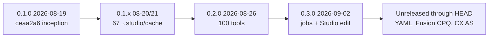

# Release notes (changelog)

All notable changes to **Oracle CPQ MCP** (`oracle-cpq-mcp`). Format inspired by [Keep a Changelog](https://keepachangelog.com/en/1.1.0/).  
Package version today: **`0.3.0`** (see [`pyproject.toml`](../pyproject.toml)). Covers **every git commit from inception (`ceaa2a6`, 2026-08-19) through HEAD** — **31** commits, no tags. Root [`CHANGELOG.md`](../CHANGELOG.md) is a pointer here.

Related docs: [FEATURES.md](FEATURES.md) · [FAQ.md](FAQ.md) · [TOOL_CATALOG.md](TOOL_CATALOG.md) · [LIVE_SMOKE_MATRIX.md](LIVE_SMOKE_MATRIX.md) · [SETUP.md](SETUP.md) · [QUICKSTART.md](QUICKSTART.md) · [UPGRADE.md](UPGRADE.md) · [SECURITY.md](../SECURITY.md) · [README — Update the package version](../README.md#update-the-package-version)

## How to refresh

```bash
python scripts/update_release_notes.py
```

The script regenerates **only** the git-backed list between `<!-- git-commits -->` markers from `git log` (idempotent). A **pre-commit** hook runs the same command; if the file changes, re-stage `docs/RELEASE_NOTES.md` and commit again.

Narrative sections above the markers are **hand-maintained** — update them when you ship meaningful features (do not rely on commit subjects alone).

## How to cut a versioned release

See also the contributor checklist in the [README](../README.md#update-the-package-version).

1. Bump `version` in [`pyproject.toml`](../pyproject.toml).
2. Move the current Unreleased **Highlights / Added / Changed / …** blocks under a new heading such as `## [0.3.0] - YYYY-MM-DD`.
3. Leave a fresh Unreleased section and keep the standalone git-commits HTML comment markers for future commits.
4. If tools changed: regenerate `tool_manifest.json` and `docs/TOOL_CATALOG.md`, then run tests.
5. Commit and optionally tag: `git tag v0.3.0`.

---

## Unreleased

Package remains **`0.3.0`**; Prompt Studio app is **`0.4.4`**. Catalog is **183** tools (`cx_module`: 101 `cpq` + 25 `meta` + 36 `sales` + 21 `prm`). Reload / restart Oracle CPQ MCP after pull so new tools and instruction text appear. Cursor’s MCP panel may also list a host `mcp_auth` helper — that name is **not** in the Oracle catalog.

Working-tree notes below cover `git diff HEAD` (not yet committed). Prior CX Adaptive Search wave remains in the Highlights / Added sections that follow.

### Summary (working tree vs HEAD)

| Area | What changed |
|------|----------------|
| **CPQ collection filters** | Shared `cpq_collection.py` + `_CpqCollectionFilters*` inputs; `q_expr` / `orderby` / `fields` / `expand` / `finder` / `total_results` / `only_data` on CPQ list/get tools |
| **Refined prompt in docs** | Profile `include_refined_prompt_in_documents` (default true); Word/Excel prepend filled params (no **Variables**) |
| **YES-gate footer** | Split **Search / Adaptive Search** (CX) vs **Search / CPQ collections**; product/module tags |
| **Prompt Studio 0.4.4** | Product (`cpq`/`cx`) + CX-module filters on saved library |
| **History merge** | Full inception→HEAD narrative consolidated into this file |

### Features

- **CPQ REST collection query helpers** — [`mcp/oracle_cpq_mcp/core/cpq_collection.py`](../mcp/oracle_cpq_mcp/core/cpq_collection.py): `cpq_collection_extra`, `cpq_list_params`, `cpq_expand_params` map MCP args to Oracle Query Collections (`q`, `orderby`, `fields`, `expand`, `finder`, `onlyData`, pagination). Wired through `users`, `groups`, `datatables`, `parts`, `bml`, `configuration`, `commerce`, `transactions`, `performance`, `metrics`, `saved_searches`.
- **Typed filter models** — [`security/validation.py`](../mcp/oracle_cpq_mcp/security/validation.py): `_CpqPaginationFilters`, `_CpqCollectionFiltersLite`, `_CpqCollectionFilters`, `_CpqExpandFilters`; list/get inputs inherit instead of duplicating fields. Catalog notes `CPQ_COLLECTION_FILTERS_NOTE` / `CPQ_EXPAND_GET_NOTE` in [`tool_registry.py`](../mcp/oracle_cpq_mcp/registry/tool_registry.py); several list/get tools bumped to **1.1.0**.
- **`include_refined_prompt_in_documents`** — [`config.py`](../mcp/oracle_cpq_mcp/core/config.py) / [`profile_yaml.py`](../mcp/oracle_cpq_mcp/core/profile_yaml.py); host override `CPQ_INCLUDE_REFINED_PROMPT_IN_DOCUMENTS`. [`refined_prompt_document.py`](../mcp/oracle_cpq_mcp/prompts/refined_prompt_document.py): `prepare_refined_prompt_for_document`, `compose_export_notes`, `prepend_refined_prompt_sheet` (strip Variables / unused `{{ }}`). [`response_export.py`](../mcp/oracle_cpq_mcp/tools/response_export.py) `refined_prompt` on `export_response_excel` (**1.2.0**) and `export_response_word` (**1.5.0**).
- **YES-gate / instructions** — [`instructions.py`](../mcp/oracle_cpq_mcp/prompts/instructions.py): `CPQ_COLLECTION_QUERY`, `DOCUMENTS_INCLUDE_REFINED_PROMPT`; `REFINED_PROMPT_CORE` emits separate CX Adaptive Search vs CPQ collection sections; tags must include `cpq` and/or `cx` (+ module).
- **Product / CX-module tags** — [`tags.py`](../mcp/oracle_cpq_mcp/prompts/tags.py): `PRODUCT_TAGS`, `CX_MODULE_TAGS`; `tags_for_tools` stamps from `ToolSpec.cx_module`.
- **Prompt Studio 0.4.4** — [`apps/prompt_studio/app.py`](../apps/prompt_studio/app.py) `_filter_product_module`; `GET /api/prompts` query params `product` / `cx_module`; toolbar filters in `static/index.html` + `app.js`.
- **Docs / agent mirrors** — FAQ / FEATURES / TOOL_CATALOG / `AGENTS.md` / `.cursor/rules/cpq-mcp-core.mdc` for collection filters, footer split, and document refined-prompt flag.

### Bug Fixes

- None in this working-tree wave.

### Performance & Refactoring

- Consolidated duplicated pagination / `q_expr` / `fields` / `orderby` validators into shared `_Cpq*` base models in `validation.py` (net ~350 lines removed from per-tool input classes).
- Tool handlers call `cpq_list_params` / `cpq_expand_params` instead of ad-hoc query dicts (`configuration.py`, `datatables.py`, `groups.py`, `users.py`, `transactions.py`, etc.).

### Config / Dependencies

- [`.config/example.yaml`](../.config/example.yaml) / [`example_fusion.yaml`](../.config/example_fusion.yaml): `include_refined_prompt_in_documents: true` (+ comments).
- No new third-party dependencies.

### Summary (prior wave — Adaptive Search / CX, already on HEAD)

| Area | What shipped |
|------|----------------|
| **Adaptive Search** | Top-level CX `list_*` → POST `searchResources/.../custom-actions/queries` (`Preference: transient`); +7 discovery/suggest tools |
| **Fusion CX Sales** | **36** catalog tools (29 prior Sales GETs + 7 Adaptive Search discovery/suggest) |
| **Fusion CX PRM** | **21** tools (ADF `get_*`/children unchanged; top-level lists use Adaptive Search) |
| **CX runtime** | `CXClient.post` + headers; `cx_adaptive_list` / `crm_search_path` |
| **Breaking** | Top-level CX list `q` is Adaptive Search JSON (not ADF SCIM); `finder` removed |
| **Docs** | FEATURES / FAQ / README / LIVE_SMOKE / STANDARDS for AS migration |

### Highlights

#### Fusion CX Adaptive Search + Sales/PRM (catalog 183)

- **Adaptive Search (CX only, not CPQ):** Top-level `list_accounts`, `list_contacts`, `list_leads`, `list_opportunities`, `list_products`, `list_territories`, `list_partners`, `list_partner_contacts`, `list_deals`, `list_partner_programs`, `list_partner_tiers` call POST `{cx.url}/crmRestApi/searchResources/11.13.18.05/custom-actions/queries` with `Preference: transient` via `cx_adaptive_list`. Entity map in `CX_AS_ENTITY_BY_TOOL`. **ADF remains** for all `get_*`, child collections, and `list_partner_lov`. CPQ `searchResources` commerce saved searches are unchanged.
- **Discovery / Smart Suggest (+7):** `list_adaptive_search_metamodels`, `list_adaptive_search_entities`, `get_adaptive_search_entity`, `list_adaptive_search_entity_attributes`, `list_adaptive_search_entity_fields`, `list_adaptive_search_operators`, `suggest_adaptive_search` (`Preference: recommend`). Registered whenever any `cx.modules` entry is enabled. No saved-search mutate; no Smart Action execution.
- **CX tools package:** handlers under [`mcp/oracle_cpq_mcp/tools/cx/`](../mcp/oracle_cpq_mcp/tools/cx/) (`sales.py`, `prm.py`, `adaptive_search.py`, shared `_common.py`). `register_cx_tools` registers Adaptive Search helpers for any enabled module, then Sales/PRM registrars.
- **Sales (catalog `cx_module=sales`):** prior territories/accounts/contacts/leads/products/opportunities + children, plus Adaptive Search discovery tools. Requires `cx.enabled` and (for Sales lists) `Sales` in `cx.modules`.
- **PRM (21):** `list_partners` / `get_partner`; **`list_partner_lov`**; contacts, deals, programs, tiers, geographies, partner-contact children. Top-level lists use Adaptive Search; children/LOV stay ADF. Partners keyed by **CompanyNumber**.
- **`list_partner_lov`:** GET `partners/{CompanyNumber}/lov/{LovName}` to resolve partner LookupCode values to Meaning/DisplayLabel after `list_partners` / `get_partner`. Convention: field `PartnerProfilePEO_<suffix>` → `lov_name=PartnerProfilePEO_LOVVA_For_<suffix>`. Optional `lookup_code` sets `q=LookupCode="…"` when `q` is omitted. Do not invent `lov_name`; if unknown, `get_partner(only_data=false)` and follow `rel=lov` links. MCP instructions + Cursor mirror tell agents to resolve codes before user-facing status answers.
- **Module gating:** Service / Field Service / Subscription / Incentive Compensation remain **allowlist names only** (no handlers yet). Filter with `discover_tools(domain=…)` or `discover_tools(cx_module=sales|prm)`.
- **Live honesty:** Core Sales/PRM GETs exercised on Fusion CX; new account-child and opportunity tools are **untested live** — see [`LIVE_SMOKE_MATRIX.md`](LIVE_SMOKE_MATRIX.md). Some ADF `q` / `fields`+`expand` combinations return 400.

#### Profile / clients / agent policy

- **Dual CPQ + CX Fusion profile YAML (format 1.06):** nested `environments.<env>.cpq` and `cx` blocks, each with its own URL and `auth: basic` (default) or `bearer`. CX `modules` required when CX is enabled. Legacy flat env + `cpq_mode` still migrate. Samples: [`.config/example.yaml`](../.config/example.yaml), [`.config/example_fusion.yaml`](../.config/example_fusion.yaml).
- **`fusion_modules` / `cx.modules` (format 1.05+):** YAML list of Fusion CX modules. **Sales** and **PRM** now register GET tools; other allowlisted names remain reserved. Host `CPQ_FUSION_MODULES`.
- **Fusion-hosted CPQ:** nested `cpq.hosted: fusion` + `cpq.auth: bearer` → OAuth Bearer + `/cpq/rest/{version}` for CPQ REST via `CPQClient` (same tools as standalone). Legacy `cpq_mode` / `fusion_enabled` still migrate.
- **Customer knowledge memory:** `get_customer_knowledge` / `ensure_customer_knowledge` / `append_customer_knowledge` persist engagement discoveries under `knowledge/{customer_id}.md`; profile `customer_knowledge_file` auto-wired via ensure. Reload MCP so the next chat injects updated knowledge.
- **Agent instruction compression + frugal_mode:** `build_server_instructions` shortened; `frugal_mode` / `CPQ_FRUGAL_MODE` forces refined footer / post-response export / Prompt Studio ensure off.
- **Tool catalog columns:** each tool lists **CPQ REST URL** and **Fusion REST URL**. Sales/PRM put the CRM path in the Fusion column and mark the CPQ column as not-CPQ (regenerate with `python scripts/generate_tool_catalog.py`).
- Branded Word/Excel/PPT exports via `.config/template/` + Mermaid diagrams in analytical Word exports (local `mmdc`).
- Prompt Studio **0.4.4** (product/CX-module filters, ratings, API logs, Profiles & Paths). Agents call `ensure_prompt_studio` after YES-gate CPQ work.
- Unified customer profile YAML; maintainer CLI `oracle-cpq`; defaults `local_data_policy=prefer`, `post_response_export=always_excel`.
- Profile `include_refined_prompt_in_documents` (default true) prepends YES-gate refined prompt (filled search params, no Variables) on Word/Excel exports.
- CPQ list/get tools accept Oracle collection filters via `cpq_collection` helpers (not Adaptive Search JSON).

#### Documentation (CX wave)

- Updated for **183** tools, Adaptive Search list migration, and Sales/PRM: [`FEATURES.md`](FEATURES.md), [`FAQ.md`](FAQ.md), [`README.md`](../README.md), [`SETUP.md`](SETUP.md), [`QUICKSTART.md`](QUICKSTART.md), [`UPGRADE.md`](UPGRADE.md), [`LIVE_SMOKE_MATRIX.md`](LIVE_SMOKE_MATRIX.md), [`STANDARDS.md`](STANDARDS.md), [`COMMON_PROMPTS.md`](COMMON_PROMPTS.md), [`PRE_COMMIT_REVIEW.md`](PRE_COMMIT_REVIEW.md), [`templates/NEW_TOOL.md`](templates/NEW_TOOL.md), [`AGENTS.md`](../AGENTS.md), [`knowledge/CPQBaseKnowledge.md`](../knowledge/CPQBaseKnowledge.md).
- Mermaid diagrams for CPQ vs CX clients, Adaptive Search registration, module gating, partner LOV resolve, customer-knowledge reload, and YAML `cpq`/`cx` split.
- FAQ: Adaptive Search vs ADF list filters; partner LookupCode; why Cursor may show fewer than 183 tools; `discover_tools` accepts `sales` / `prm` / `cx_module`.
- YES-gate refined footer: emit **Search / Adaptive Search** (CX) and/or **Search / CPQ collections** only when those filters were used; tags include `cpq`/`cx` + module — see `REFINED_PROMPT_CORE` in [`instructions.py`](../mcp/oracle_cpq_mcp/prompts/instructions.py).
- Example profile comments no longer say CX is “helper only”.

### Added

#### Working tree (uncommitted)

- [`mcp/oracle_cpq_mcp/core/cpq_collection.py`](../mcp/oracle_cpq_mcp/core/cpq_collection.py) — CPQ Query Collections param builders.
- [`mcp/oracle_cpq_mcp/prompts/refined_prompt_document.py`](../mcp/oracle_cpq_mcp/prompts/refined_prompt_document.py) — strip Variables / unused placeholders for Office exports.
- Profile flag `include_refined_prompt_in_documents` + env `CPQ_INCLUDE_REFINED_PROMPT_IN_DOCUMENTS`.
- Prompt Studio Product / CX-module library filters (app **0.4.4**).
- Tests: `tests/test_cpq_collection.py`, `tests/test_datatable_collection_filters.py`, `tests/test_refined_prompt_document.py` (+ updates to config, export, tags, Studio, instructions).

#### Fusion CX

- [`mcp/oracle_cpq_mcp/core/cx_client.py`](../mcp/oracle_cpq_mcp/core/cx_client.py) — Fusion CX REST client (Basic/Bearer from nested `cx:`).
- [`mcp/oracle_cpq_mcp/tools/cx/`](../mcp/oracle_cpq_mcp/tools/cx/) — `sales.py`, `prm.py`, `adaptive_search.py`, `_common.py` (`cx_adaptive_list` + ADF helpers).
- Adaptive Search discovery/suggest tools (7) + top-level list migration to `searchResources` (tool versions **2.0.0**).
- **Sales tools (core):** `list_territories`, `get_territory`, `list_accounts`, `get_account`, `list_account_team`, `get_account_team_member`, `list_contacts`, `get_contact`, `list_leads`, `get_lead`, `list_lead_opportunities`, `get_lead_opportunity`, `list_products`, `get_product`.
- **Sales tools (account children + opportunities):** `list_account_attachments`, `get_account_attachment`, `list_account_addresses`, `get_account_address`, `list_account_primary_addresses`, `get_account_primary_address`, `list_opportunities`, `get_opportunity`, `list_opportunity_attachments`, `get_opportunity_attachment`, `list_opportunity_contacts`, `get_opportunity_contact`, `list_opportunity_revenue_partners`, `get_opportunity_revenue_partner`, `list_opportunity_team`.
- **PRM tools:** `list_partners`, `get_partner`, `list_partner_lov`, `list_partner_contacts`, `get_partner_contact`, `list_deals`, `get_deal`, `list_partner_programs`, `get_partner_program`, `list_partner_tiers`, `get_partner_tier`, `list_partner_geographies`, `get_partner_geography`, `list_partner_contact_addresses`, `get_partner_contact_address`, `list_partner_contact_attachments`, `get_partner_contact_attachment`, `list_partner_contact_contact_points`, `get_partner_contact_contact_point`, `list_partner_contact_user_details`, `get_partner_contact_user_detail`.
- Typed inputs in `security/validation.py` (CX ADF collection models + `ListPartnerLovInput` with path-safe `lov_name`).
- ToolSpecs: top-level lists `http_method=POST` on `/crmRestApi/searchResources/…/custom-actions/queries` (v**2.0.0**); ADF `get_*`/children remain GET on `/crmRestApi/resources/…`; Adaptive Search discovery tools; manifest regenerated (tool_count **183**).
- Unit tests: `tests/test_adaptive_search.py`, `tests/test_sales_tools.py`, `tests/test_prm_tools.py`, `tests/test_cx_client.py`; contract kwargs for all CX + customer-knowledge tools in `tests/test_tool_contracts.py`.
- MCP instructions: Fusion modules + Adaptive Search filter rule + PRM LOV resolve; Cursor mirror `.cursor/rules/cpq-mcp-core.mdc`.

#### Earlier Unreleased (still shipping)

- `oracle_cpq_mcp.exporters.branded_documents` and `mermaid_render` (clone templates; local Mermaid PNG).
- Word `diagrams` on `export_response_word`; lightweight structured `notes` (`##` / bullets); center-aligned diagram images/captions; tall-diagram height cap.
- Cross-IDE agent policy in `AGENTS.md` + MCP `DOCUMENT_TEMPLATES` (Mermaid expected for analytical Word without user ask).
- Prompt Studio profile stamp/filter (`SavedPrompt.profile`, `GET /api/profiles`, toolbar select); restart scripts `scripts/restart-prompt-studio.*`.
- MCP tools `list_product_hierarchy_table` and `list_commerce_processes_table` (flat variable-name tables).
- MCP tool `ensure_prompt_studio` — probe/auto-start local Prompt Studio after YES-gate site/cache turns.
- MCP customer knowledge tools (`get_customer_knowledge`, `ensure_customer_knowledge`, `append_customer_knowledge`) — meta; local `knowledge/` only. Gitignore `knowledge/*` except `CPQBaseKnowledge.md`.
- [`mcp/oracle_cpq_mcp/core/profile_yaml.py`](../mcp/oracle_cpq_mcp/core/profile_yaml.py) full-document loader; [`scripts/migrate_profile_yaml.py`](../scripts/migrate_profile_yaml.py); [`.config/example.yaml`](../.config/example.yaml).
- `PyYAML` dependency and [`mcp/oracle_cpq_mcp/core/catalog.py`](../mcp/oracle_cpq_mcp/core/catalog.py) loader.
- Prompt Studio ratings/comments APIs; per-source `record_prompt_use` **1.1.0** (`duration_ms` + `source=cache|api|mixed`); Profiles & Paths APIs; Studio **0.4.1–0.4.3** UI (rating filter, version badge, autosize edit areas, Help).
- `export_response_word` catalog **1.2.0** — Mermaid `pie` / `xychart-beta` / `flowchart` guidance.
- Profile `frugal_mode` / host `CPQ_FRUGAL_MODE`; format **1.05** `fusion_modules` → **1.06** nested `cpq`/`cx`.

### Changed

- `register_tool` now passes FastMCP `name=<catalog name>` so handshake tool lists match `TOOL_CATALOG` (avoids silent `fn.__name__` drift).
- `discover_tools` filters by `cx_module` (`sales` / `prm` / `meta` / …); meta tools stay hidden unless requested.
- Catalog generator preamble documents nested `cpq.hosted` / CRM REST for Sales/PRM (not only legacy `cpq_mode` + `fusion_enabled`).
- MCP `build_server_instructions` compressed; knowledge / `AGENTS.md` / Cursor mirrors slimmed.
- Example profiles: CX comments updated — Sales/PRM are real GET tools (not “helper only”); `include_refined_prompt_in_documents` documented.
- Prompt Studio static cache-bust / list grid / Help / README (app **0.4.4**); saved-prompt dedupe per content hash + profile; Product/CX-module filters.
- `export_response_excel` **1.2.0** / `export_response_word` **1.5.0** — optional `refined_prompt` when profile flag is on.
- CPQ list/get catalog descriptions note collection filters; shared `_CpqCollectionFilters*` in `validation.py`.
- Profile template path renamed `.config/.profile.yaml.example` → `.config/example.yaml`.
- Doc counts and checklists (README / FEATURES / FAQ / PRE_COMMIT) updated **122/123/126 → 157 → 172 → 176 → 183**.

### Fixed

- Contract-test gap: CX Sales/PRM + customer-knowledge tools were in `TOOL_CATALOG` but missing from `tests/test_tool_contracts.py` (FakeCXClient + TOOL_KWARGS for all 34 names, including `list_partner_lov`).
- Cursor handshake could omit a newly added Oracle tool while still showing 157 names (host `mcp_auth` filling a slot) — mitigated by explicit FastMCP `name=` on register.
- Empty Word/Excel table rows when agents passed list-of-list sheet `rows` — `coerce_sheet_records` maps positional lists to column dicts.
- MCP startup fail-closed on stale `tool_manifest.json` after tool-description edits — regenerate via `write_manifest_file()`.
- Invalid profile YAML `local_data_policy: true` (bool) rejected by schema — must be `ask`|`prefer`|`never` (string).

### Documentation

- [`TOOL_CATALOG.md`](TOOL_CATALOG.md) regenerated (**183** tools; Adaptive Search + Sales/PRM; `searchResources` / `resources` CRM paths in Fusion URL column).
- [`FEATURES.md`](FEATURES.md) — CX Adaptive Search vs ADF table, architecture Mermaid, partner LOV flow, customer-knowledge flow; catalog table **183**.
- [`FAQ.md`](FAQ.md) — CX coverage, `list_partner_lov` how-to, Cursor tool-count FAQ, `discover_tools` domains.
- [`LIVE_SMOKE_MATRIX.md`](LIVE_SMOKE_MATRIX.md) — Sales/PRM **Used live**; other CX modules **No tools yet**.
- [`QUICKSTART.md`](QUICKSTART.md) §6.12 Fusion CX sample prompts; SETUP/UPGRADE `cx.modules` wording.
- [`STANDARDS.md`](STANDARDS.md) / [`templates/NEW_TOOL.md`](templates/NEW_TOOL.md) — `CXClient`, catalog `name=`, contract coverage for CX.
- Doc sync tests: `tests/test_docs_tool_catalog.py` asserts FEATURES/FAQ catalog count + `list_partner_lov`.

### Git commits (auto-generated)

<!-- git-commits -->
- `97605ec` added CX tools
- `4fe10bc` added CX tools
- `01ee399` added CX tools
- `6da1c42` feature additions. fusion CPQ
- `47229e1` feature additions
- `c8ef795` feature additions
- `d004860` improved documentation
- `b5bba1d` generic improvements
- `3f86111` generic improvements
- `2b890d5` committed some leftovers
- `3f71082` Ship branded Word/Mermaid exports and Prompt Studio profile filter.
- `9afbe0c` add yaml support
- `62bcf6f` Ship 0.3.0 agent UX and Prompt Studio editing.
- `17d2b93` major feature addition
- `32f8320` major feature addition
- `f90354a` some documentation
- `d88bb7b` some documentation
- `2ee4c83` Added couple of tools, better prompt suggestios, prompt studio
- `fda086e` release notes
- `a1b39e2` release notes
- `c000974` Expand MCP catalog to 67 tools with tasks, configuration, parts, and transactions.
- `b3f0445` updated quickstart
- `b5c97c5` updated documentation
- `c05cd49` updated documentation
- `494b2ee` Restructure QUICKSTART for clearer first-time setup flow.
- `90bb92c` Add cross-platform MCP config, output validation, and doc sync for 19 tools.
- `62f1a29` Add MCP best-practice envelopes, annotations, and progress
- `df85397` Add JSON Schema output contracts for all MCP tools
- `0714bcb` Add commerce and line-level attribute and action metadata tools
- `130ba9b` Add get_all_bml_code MCP tool for BML export and util library source
- `ceaa2a6` first commit
<!-- /git-commits -->

---

## [0.3.0] - 2026-09-02

Cut commit: `62bcf6f` — Ship 0.3.0 agent UX and Prompt Studio editing.

### Highlights

Agent-UX release: **async BML jobs**, **local cache resources**, **dual-env examples**, **capability/smoke honesty**, configurable HTTP timeouts. Catalog **103** tools.

| Area | What you get |
|------|----------------|
| Async BML | `start_bml_site_export` → poll `get_local_job` (avoids multi-minute MCP blocks) |
| Local search | `search_local_bml` over `data/.../bml/site/` |
| Resources | `cpq://local`, `cpq://local/bml/{path}` |
| Timeouts | Profile `HTTP_TIMEOUT` / host `CPQ_HTTP_TIMEOUT` (default 60s) |
| Dual env | `.cursor/mcp.json.dual.example.json` + Antigravity dual example; envelopes stamp `profile` |
| Honesty | [`LIVE_SMOKE_MATRIX.md`](LIVE_SMOKE_MATRIX.md) + capability card in server instructions |
| Prompt Studio | Title/variable edit, Run/Edit cache-bust, placeholder improvements |

### Added

- `start_bml_site_export`, `get_local_job`, `search_local_bml` (`local_jobs.py`)
- MCP resources for local data index and BML file reads (`prompts/local_resources.py`)
- Dual-MCP config examples; FAQ async agent loop for BML/exports
- Configurable HTTP timeout (5–3600s)

### Changed

- Tool envelopes include `profile` (alias of `customer_id`) plus `environment`
- `get_all_bml_code` docs point agents at async job path for large sites
- Package / `__init__` version **0.3.0**; FAQ / FEATURES / TOOL_CATALOG updated for jobs and Studio editing

---

## [0.2.0] - 2026-08-26

### Highlights

**100 MCP tools**, local caching, reusable refined prompts, optional Prompt Studio, and stronger operator diagnostics.

| Area | What you get |
|------|----------------|
| Tool catalog | **100** tools — users, groups, datatables, BML, commerce (incl. saved searches), metrics, collab, **admin** (certificates/SSO), performance, parts, tasks, configuration, meta |
| Diagnostics | **DEBUG_MODE** file logging of redacted CPQ request traces under `logs/{profile}-{environment}.log` |
| Local cache | Snapshots under `data/{profile}/{env}/` with ask/prefer/never policy |
| Refined prompts | End-of-task footer + optional auto-save + picker |
| Prompt Studio | UI on **8765** — cards/list, favorites/suites, Run modal, **Download all** library JSON |
| Docs | FAQ, FEATURES, formal TOOL_CATALOG, contributor version-bump section in README |

### Added

#### This release focus

- Commerce **saved searches** — `list_saved_searches`, `get_saved_search` (`GET /searchResources/...`; resource defaults from commerce process var).
- Site **admin** domain — `list_certificates`, `get_certificate`, `get_sso_configuration`; PEM / IdP / SAML keystore fields redacted to `[REDACTED]`.
- Prompt Studio **Download all** — `GET /api/prompts/download` (full `.prompts/saved_prompts.json`; includes disabled by default).
- **DEBUG_MODE API file logging** — profile `DEBUG_MODE` (default `true`; host `CPQ_DEBUG_MODE` / `CPQ_DEBUG_LOG_DIR`). Appends timestamped, redacted request traces (curl + parameters) to `logs/{profile}-{environment}.log`. Passwords stay `***`; response bodies are not logged. Live `CPQClient` HTTP only (cache-only work writes nothing).
- Formal catalog at **100** tools ([`TOOL_CATALOG.md`](TOOL_CATALOG.md); regenerate: `python scripts/generate_tool_catalog.py`).

#### Catalog domains already in this line (summary)

Shipped earlier in the 0.1.x → 0.2.0 growth path (not re-listed as new APIs this week):

- Metrics (`list_metrics`), collab queues, commerce UI settings, transactions, performance logs, parts, tasks, configuration (`productFamilies`), broader BML/datatables, `discover_tools`.
- Refined-prompt footer + library tools; local `data/` sync policy; post-response Excel/Word export.
- BML zip + extract to `data/.../bml/site/`; Prompt Studio app; FAQ / FEATURES / pre-commit docs.

Details for those areas remain in [FEATURES.md](FEATURES.md) and the README domain summary.

### Changed

- README tool list slimmed to a **domain summary** (full per-tool tables live in TOOL_CATALOG).
- README adds **Update the package version** for contributors cutting releases.
- `.env.example` / server instructions cover DEBUG_MODE, refined prompts, local-data policy, post-response export.
- Schema integrity / `tool_manifest.json` updated for the 100-tool catalog.

### Security

- Default **`READ_ONLY=true`**; writes use dry-run + HMAC `confirmation_token`.
- Certificate/SSO PEM material never returned unredacted through MCP.
- Credentials never belong in MCP JSON — [SECURITY.md](../SECURITY.md).

### Known gaps / testing honesty

Offline unit/contract tests cover the catalog. Against **live** CPQ, still **untested**:

- Tasks (`get_task`, `download_task_file`)
- Configuration / `productFamilies` / layout cache
- Some newer BML extensions and datatable create/export writes
- Saved searches / certificates / SSO may 404 on sites still on REST **v18** (Oracle docs target **v19**)

**Dual environments:** one MCP process = one active env. For dev+test in one prompt, use two MCP entries or compare `data/{profile}/dev` vs `test` — [FAQ](FAQ.md#can-the-llm-connect-with-two-environments-at-the-same-time).

### Git commits (0.2.0 cut only)

- `32f8320` — major feature addition (0.2.0 catalog, admin, metrics, collab, exports, debug log)
- `17d2b93` — README follow-up for 0.2.0

---

## [0.1.0] - 2026-08-19 – 2026-08-21

Inception and first production-shaped MCP server. Package version **0.1.0** throughout this window.

### 2026-08-19 — Initial commit (`ceaa2a6`)

First tree: FastMCP server, `CPQClient`, profile `.env` loading, security stack (READ_ONLY, dry-run, confirmation, rate limit, replay, sanitization, schema integrity), and tools for **users**, **groups**, **data tables**, plus `discover_tools` and Excel user export. Docs: README, SETUP, QUICKSTART, SECURITY, threat model, GitHub security workflow. Tests for config, client, pagination, preflight, and security invariants. ~19 catalog tools.

### Added (same day)

- `130ba9b` — `get_all_bml_code` (zip via `GET /adminMeta`, JSON util library); `CPQClient.get_bytes`.
- `0714bcb` — Commerce main + line **attribute and action** metadata tools (`COMMERCE_PROCESS_VAR_NAME` defaults).
- `df85397` — JSON Schema **output contracts** for all tools.
- `62f1a29` — Success **envelopes** `{status, tool, data}`, ToolAnnotations, MCP **progress** for long BML/user exports.

### Added / Changed 2026-08-20

- `90bb92c` — Cross-platform MCP launchers (`scripts/mcp-server.cmd` / `.sh`), example configs for Cursor/VS Code/Antigravity (incl. unix), post-execution output schema validation, docs synced to ~19 tools.
- `494b2ee` / `c05cd49` / `b5c97c5` / `b3f0445` — QUICKSTART/README restructure; audit report and `prompts/audit.md`.
- `c000974` — Catalog expansion to **67 tools**: configuration (`productFamilies`), parts, performance logs, async **tasks**, transactions; pre-commit, STANDARDS, RELEASE_NOTES generator, eval harness, schema lint. Cursor rules for tool authoring.
- `a1b39e2` / `fda086e` — Release notes / README nits.

### Added 2026-08-21

- `2ee4c83` — `scripts/generate_tool_catalog.py` (catalog markdown from registry).
- `d88bb7b` — **Prompt Studio** app, saved-prompt library, local `data/{profile}/{env}/` cache, refined-prompt footer + MCP instructions, FAQ/FEATURES/TOOL_CATALOG, Cursor saved-prompt skill/command. (Commit subject says “documentation”; the diff is the 0.1→studio/cache/prompts wave, ~87+ tools.)
- `f90354a` — Expanded `docs/RELEASE_NOTES.md` narrative.

### Milestone summary

| Milestone | Summary |
|-----------|---------|
| Commerce metadata | Main + line attribute/action tools; process defaults from `COMMERCE_PROCESS_VAR_NAME` |
| BML export | `get_all_bml_code` zip + util-library JSON delivery |
| MCP quality | JSON Schema output contracts, envelopes/annotations/progress, schema integrity |
| Cross-platform MCP | Antigravity / Cursor / VS Code examples; `.cmd` + `.sh` launchers |
| Catalog growth | ~19 → 67 → ~87 tools (then **100** in 0.2.0) |
| Quick setup (`SETUP.md`) | 8-step first-time path |
| Full setup guide (`QUICKSTART.md`) | Detailed install, MCP connect, samples |

---

## Version timeline



| Version | First commit | Date | Snapshot |
|---------|--------------|------|----------|
| 0.1.0 | `ceaa2a6` | 2026-08-19 | Users/groups/datatables + security MCP |
| 0.1.x | `c000974`–`d88bb7b` | 2026-08-20–21 | 67 tools → Prompt Studio, local data, refined prompts |
| 0.2.0 | `32f8320` | 2026-08-26 | 100 tools, admin, metrics, exports |
| 0.3.0 | `62bcf6f` | 2026-09-02 | Async BML jobs, Studio editing |
| Unreleased | `9afbe0c`–`HEAD` | 2026-09-11– | YAML profiles, Fusion CPQ, CX Adaptive Search (183 tools) |

Compare: [Unreleased vs 0.3.0](https://github.com/singhramandeep/oracleCPQMCP/compare/62bcf6f...HEAD) · [0.3.0](https://github.com/singhramandeep/oracleCPQMCP/commit/62bcf6f) · [0.2.0](https://github.com/singhramandeep/oracleCPQMCP/commit/32f8320) · [0.1.0](https://github.com/singhramandeep/oracleCPQMCP/commit/ceaa2a6)

---

## Commit index (oldest → HEAD)

| Date | SHA | Subject |
|------|-----|---------|
| 2026-08-19 | `ceaa2a6` | first commit |
| 2026-08-19 | `130ba9b` | Add get_all_bml_code MCP tool for BML export and util library source |
| 2026-08-19 | `0714bcb` | Add commerce and line-level attribute and action metadata tools |
| 2026-08-19 | `df85397` | Add JSON Schema output contracts for all MCP tools |
| 2026-08-19 | `62f1a29` | Add MCP best-practice envelopes, annotations, and progress |
| 2026-08-20 | `90bb92c` | Add cross-platform MCP config, output validation, and doc sync for 19 tools |
| 2026-08-20 | `494b2ee` | Restructure QUICKSTART for clearer first-time setup flow |
| 2026-08-20 | `c05cd49` | updated documentation |
| 2026-08-20 | `b5c97c5` | updated documentation |
| 2026-08-20 | `b3f0445` | updated quickstart |
| 2026-08-20 | `c000974` | Expand MCP catalog to 67 tools with tasks, configuration, parts, and transactions |
| 2026-08-20 | `a1b39e2` | release notes |
| 2026-08-20 | `fda086e` | release notes |
| 2026-08-21 | `2ee4c83` | Added couple of tools, better prompt suggestios, prompt studio |
| 2026-08-21 | `d88bb7b` | some documentation |
| 2026-08-21 | `f90354a` | some documentation |
| 2026-08-26 | `32f8320` | major feature addition |
| 2026-08-26 | `17d2b93` | major feature addition |
| 2026-09-02 | `62bcf6f` | Ship 0.3.0 agent UX and Prompt Studio editing |
| 2026-09-11 | `9afbe0c` | add yaml support |
| 2026-09-25 | `3f71082` | Ship branded Word/Mermaid exports and Prompt Studio profile filter |
| 2026-09-25 | `2b890d5` | committed some leftovers |
| 2026-09-28 | `3f86111` | generic improvements |
| 2026-09-28 | `b5bba1d` | generic improvements |
| 2026-09-28 | `d004860` | improved documentation |
| 2026-09-28 | `c8ef795` | feature additions |
| 2026-09-28 | `47229e1` | feature additions |
| 2026-09-29 | `6da1c42` | feature additions. fusion CPQ |
| 2026-10-05 | `01ee399` | added CX tools |
| 2026-10-05 | `4fe10bc` | added CX tools |
| 2026-10-05 | `97605ec` | added CX tools (**HEAD**) |

Note: `scripts/update_release_notes.py` only rewrites the **Unreleased** `<!-- git-commits -->` block. The commit index and versioned sections above are hand-maintained.
