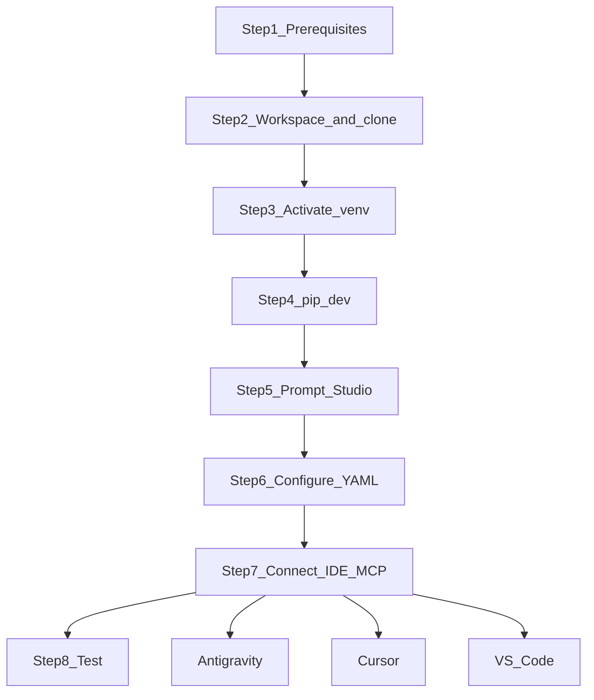

# Setup — Quick guide

Eight steps from install to a working MCP connection. For multi-OS shells, dual MCP, field-by-field profiles, and troubleshooting, use the **[Full setup guide](QUICKSTART.md)**.



Open the **IDE integrated terminal** (`` Ctrl+` ``) and run commands from the **repository root** (`pyproject.toml` present).

---

## Step 1 — Prerequisites

Install in this order (each item has a download link):

1. **IDE** — pick one:
   - [Google Antigravity](https://antigravity.google/) (recommended)
   - [Cursor](https://cursor.com/)
   - [VS Code](https://code.visualstudio.com/)
2. **Python 3.11+** — [python.org/downloads](https://www.python.org/downloads/)
3. **Node.js LTS** (includes npm) — [nodejs.org](https://nodejs.org/)
4. **Git** — [git-scm.com/downloads](https://git-scm.com/downloads/)
5. **Mermaid CLI (`mmdc`)** — after Node is installed:

```bash
npm install -g @mermaid-js/mermaid-cli
```

Package page: [npmjs.com/package/@mermaid-js/mermaid-cli](https://www.npmjs.com/package/@mermaid-js/mermaid-cli)

**Verify:**

```bash
python --version
node --version
git --version
mmdc --version
```

Other shells / OS-specific install notes → [Full setup guide](QUICKSTART.md).

---

## Step 2 — Workspace folder, download code, open in IDE

1. Create a workspace directory (example: `C:\Users\YourName\workspaces` or `~/workspaces`).
2. Clone the repo (or download ZIP from GitHub):

```bash
cd ~/workspaces   # or your Windows workspaces path
git clone https://github.com/singhramandeep/oracleCPQMCP.git oracleCPQMCP
cd oracleCPQMCP
```

Repo: [github.com/singhramandeep/oracleCPQMCP](https://github.com/singhramandeep/oracleCPQMCP)

3. In your IDE: **File → Open Folder** → select the `oracleCPQMCP` project root (must contain `pyproject.toml`).

---

## Step 3 — Activate the virtual environment

```bash
python -m venv .venv
```

**Windows PowerShell** (typical IDE terminal on Windows):

```powershell
.venv\Scripts\Activate.ps1
```

If activation is blocked: `Set-ExecutionPolicy -Scope Process Bypass`, then retry. Other shells / macOS / Linux → [Full setup guide](QUICKSTART.md#step-2--create-python-environment-and-install).

---

## Step 4 — Install package (`pip` editable with `.dev`)

```bash
pip install -e ".[dev]"
```

Extras are defined in `pyproject.toml`. Pip troubleshooting → [Full setup guide](QUICKSTART.md#step-2--create-python-environment-and-install).

---

## Step 5 — Install Prompt Studio

```bash
pip install -e ".[prompt-studio]"
```

Start later with `python -m apps.prompt_studio` → [http://127.0.0.1:8765](http://127.0.0.1:8765). Restart scripts and deep detail → [Full setup guide](QUICKSTART.md#prompt-studio-local-ui-for-saved-prompts) · [apps/prompt_studio/README.md](../apps/prompt_studio/README.md).

---

## Step 6 — Configure the YAML profile

Copy the template and name it after your customer id:

| Shell | Command |
|-------|---------|
| Windows PowerShell / CMD | `copy .config\example.yaml .config\mycompany.yaml` |
| macOS / Linux / Git Bash | `cp .config/example.yaml .config/mycompany.yaml` |

Edit `.config/mycompany.yaml` — set CPQ URL and credentials under `environments.dev` (you own passwords; never commit this file). The filename without `.yaml` is `CPQ_CUSTOMER_PROFILE`.

Field-by-field tour and `.env` migration → [Full setup guide](QUICKSTART.md#step-3--create-your-cpq-credential-profile) · [FAQ](FAQ.md#how-do-i-migrate-from-a-legacy-env-to-yaml).

---

## Step 7 — Connect the IDE (MCP)

Never put CPQ passwords in MCP JSON — only profile name and paths. Dual env (dev+test) examples → [Full setup guide](QUICKSTART.md#step-5--connect-your-ide--llm-client).

### 7a. Google Antigravity

1. Copy [`.agents/mcp_config.example.json`](../.agents/mcp_config.example.json) → `.agents/mcp_config.json`.
2. Set **absolute** paths for `command`, `cwd`, and `CPQ_CONFIG_DIR`; set `CPQ_CUSTOMER_PROFILE` to your profile id.
3. Required env: `MCP_MODE=stdio`, `DISABLE_CONSOLE_OUTPUT=true`, `CPQ_CUSTOMER_PROFILE`, `CPQ_CONFIG_DIR`.
4. Reload MCP / restart Antigravity. Verify under MCP Servers that `oracle-cpq` is connected.

Docs: [Antigravity](https://antigravity.google/) · [Antigravity MCP](https://antigravity.google/docs/mcp/) · detail: [Full setup guide — Antigravity](QUICKSTART.md#google-antigravity-ide-recommended).

### 7b. Cursor

1. Copy [`.cursor/mcp.json.example`](../.cursor/mcp.json.example) (Windows) or [`.cursor/mcp.json.unix.example`](../.cursor/mcp.json.unix.example) (macOS/Linux) → `.cursor/mcp.json`.
2. Set `CPQ_CUSTOMER_PROFILE` to your profile id.
3. Fully quit and restart Cursor. Check **Settings → MCP** for `oracle-cpq`.

Docs: [Cursor](https://cursor.com/) · detail: [Full setup guide — Cursor](QUICKSTART.md#cursor-needs-testing).

### 7c. VS Code (Copilot Agent)

1. Copy [`.vscode/mcp.json.example`](../.vscode/mcp.json.example) (Windows) or [`.vscode/mcp.json.unix.example`](../.vscode/mcp.json.unix.example) → `.vscode/mcp.json`.
2. VS Code uses `"servers"` (not `mcpServers`) and requires `"type": "stdio"`.
3. Set `CPQ_CUSTOMER_PROFILE`. Reload window. Open Copilot Chat → **Agent** mode.

Docs: [VS Code](https://code.visualstudio.com/) · detail: [Full setup guide — VS Code](QUICKSTART.md#vs-code-github-copilot-agent-needs-testing).

---

## Step 8 — Test

**Smoke (IDE terminal, venv active):**

```bash
oracle-cpq-smoke --profile mycompany --env dev
```

**Agent chat:** *“Discover CPQ tools and list 5 users.”*

Failures / DEBUG logs → [Full setup guide](QUICKSTART.md#step-4--smoke-test-verify-cpq-connectivity) · [FAQ](FAQ.md).
